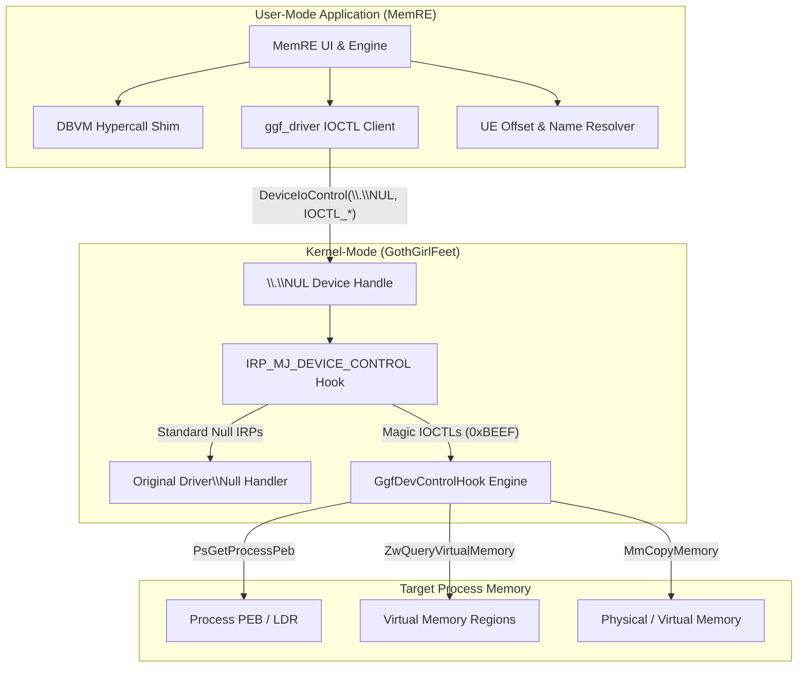

# Anti-Cheat Amateur

## Disclaimer & Research Authorization

> [!NOTE]
> This project contains security research code developed for educational and defensive anti-cheat evaluation purposes. I AM NOT RESPONSIBLE FOR ANY DAMAGES CAUSED BY THIS SOFTWARE.

## Overview

This repository demonstrates a stealth memory scanning and kernel communication methodology designed to operate undetected by Tencent's ACE (Anti-Cheat Expert). This architecture bypasses conventional detection vectors used by anti-cheat engines to identify kernel drivers and user-mode memory inspection tools.

The solution consists of two primary subsystems:
1. **`GothGirlFeet`**: A kernel-mode driver designed for manual mapping via `kdmapper`. It eschews standard driver object registration in favor of stealth dispatch table hooking on legitimate system drivers (`\Driver\Null`).
2. **`MemRE Evolved`**: A virtualized high-performance user-mode memory scanner and reverse engineering suite featuring hypervisor shims (DBVM), page-table walking, and dynamic Unreal Engine (`GWorld` / `FName`) offset resolution.

---

## Key Technical Highlights

### 1. Stealth Dispatch Table Hooking (`\Driver\Null`)
Traditional kernel drivers register a `DRIVER_OBJECT` via `IoCreateDevice` and `IoCreateSymbolicLink`. Anti-cheat solutions continuously enumerate driver objects and symbolic links to detect unauthorized drivers.
- **Mechanism:** `GothGirlFeet` locates the system's `\Driver\Null` object via `ObReferenceObjectByName` and hooks its `MajorFunction[IRP_MJ_DEVICE_CONTROL]` table entry.
- **Communication:** User-mode applications open the native null device handle (`\\.\NUL`) and send custom IOCTLs. The driver intercepts control codes while forwarding unrecognized IRPs to the original handler (`g_OrigDevControl`).
- **Detection Evasion:** Zero new driver objects or symbolic links are created in system memory.

### 2. Manual Mapping & `kdmapper` Compatibility
- Zero dependency on driver signatures or `DriverEntry` registration.
- Dynamically resolves undocumented `ntoskrnl.exe` routines (`ZwQueryVirtualMemory`, `PsGetProcessPeb`, `ObReferenceObjectByName`, `MmCopyMemory`).
- Operates entirely within allocated kernel pool memory without triggering PnP driver registration callbacks.

### 3. Hypervisor & Virtualized Memory Scanning Engine (`DBVM`)
- Integrated `dbvm_shim.h` layer providing CR3 resolution and physical page-table walking.
- Bypasses Win32 user-mode handle checks (`ReadProcessMemory`, `VirtualQueryEx`) by routing memory reads directly through hypercall interfaces or kernel IOCTL channels.

### 4. Engine-Level Offsets & Resolution
- Automated **Unreal Engine** `GWorld` pointer scanner.
- Dynamic `FName` resolution (`UENameResolver`) and engine version auto-detection (`UEVersionScanner`) for UE4 and UE5 targets.

---

## System Architecture



---

## IOCTL Interface Specification

Communication between `MemRE` and `GothGirlFeet` uses device type `0xBEEF` over `\\.\NUL`:

| IOCTL Code | Function ID | Description | Input Payload | Output Payload |
| :--- | :--- | :--- | :--- | :--- |
| `IOCTL_GGF_PING` | `0x802` | Verifies kernel hook status (returns `0xDEADC0DE`) | `NULL` | `ULONG` (Magic) |
| `IOCTL_GGF_ENUM_REGIONS` | `0x800` | Enumerates Virtual Memory committed regions for a PID | `GGF_INPUT` | `GGF_ENUM_REGIONS_OUT` |
| `IOCTL_GGF_ENUM_MODULES` | `0x801` | Traverses target PEB LDR list for loaded module bases | `GGF_INPUT` | `GGF_ENUM_MODULES_OUT` |
| `IOCTL_GGF_READ_MEMORY` | `0x803` | Reads target process memory (chunked up to 4MB) | `GGF_READ_INPUT` | Buffer Bytes |
| `IOCTL_GGF_WRITE_MEMORY` | `0x804` | Writes buffer data into target virtual address space | `GGF_WRITE_INPUT` | Status / Bytes |

---


## Building & Usage

### Prerequisites
- **Visual Studio 2022** (v143 toolset)
- **Windows Driver Kit (WDK)** 10/11
- **Windows 10/11 x64** target environment

### 1. Build Kernel Driver (`GothGirlFeet`)
Open `GothGirlFeet/GothGirlFeet.vcxproj` in Visual Studio with WDK installed:
1. Select configuration: `Release` | `x64`.
2. Build solution to produce `GothGirlFeet.sys`.

### 2. Build User-Mode Scanner (`MemRE`)
Open `MemRE/MemRE.sln` in Visual Studio:
1. Select configuration: `Release` | `x64`.
2. Build solution to produce `MemRE.exe`.

### 3. Execution Sequence
1. **Map Driver:** Use `kdmapper` (or compatible vulnerable driver mapper) to load `GothGirlFeet.sys` into kernel memory:
   ```cmd
   kdmapper.exe GothGirlFeet.sys
   ```
2. **Start Hypervisor** : Any hypervisor will work as long as you know how to enable dbvm. 
3. **Launch Scanner:** Run `MemRE.exe`.
4. **Verify Connection:** The scanner automatically pings `\\.\NUL` with `IOCTL_GGF_PING`. Upon receiving `0xDEADC0DE`, driver mode is activated for kernel-level memory reading and region enumeration.

---

